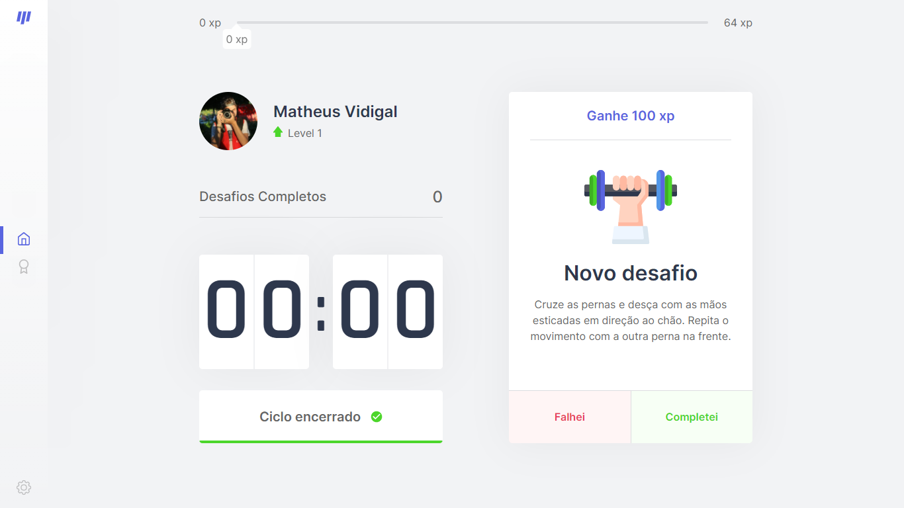
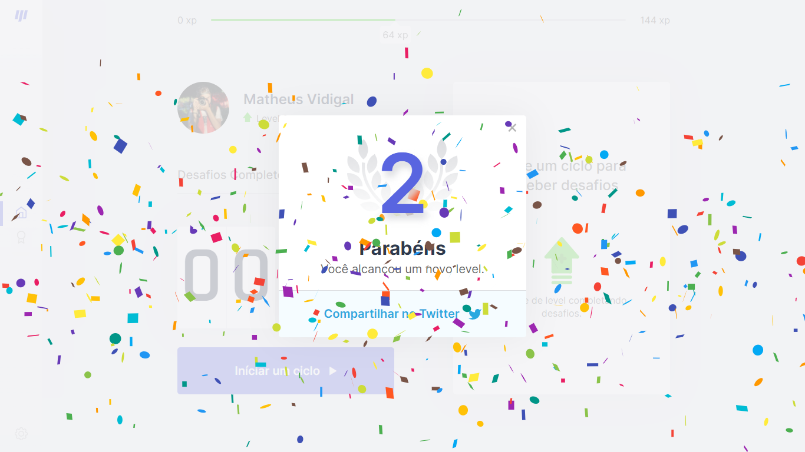

# IMGS
##### Desktop Screenshot

 

## Desktop Screenshot

<!-- Responsive, 1440 x 900, 50% (Laptop L - 1440px)-->
    
    
    
    
    
    
    
    
    
    
    
    

    <!-- IMGS
      ------------------------------
      login-blank
      login-filled
      ------------------------------
      initial-countdown
      half-countdown
      final-countdown
      ------------------------------
      modal-with-confetti
      modal-without-confetti
      ------------------------------
      image-next-level
      twitter-next-level
      ------------------------------
      leaderbord
      configs
      404
      ------------------------------
    -->