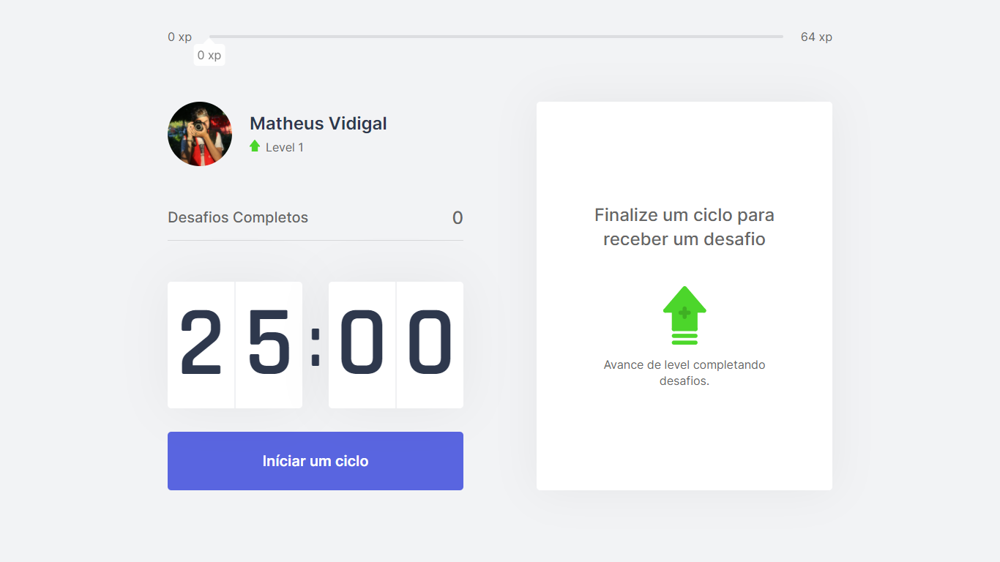
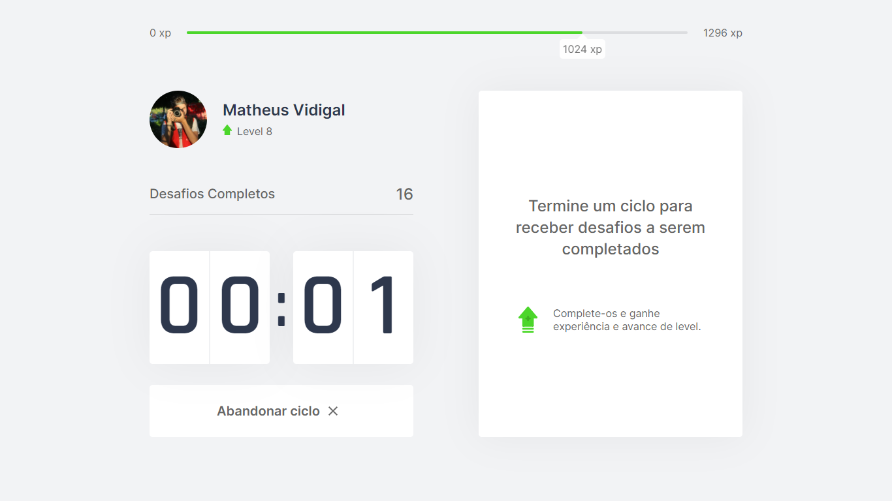
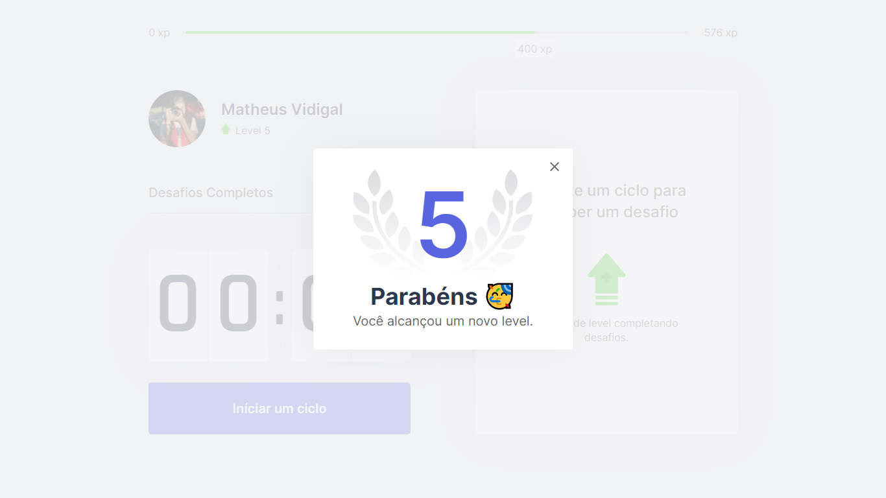
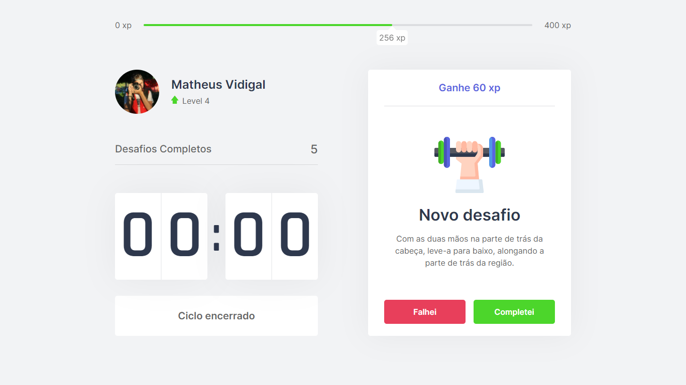
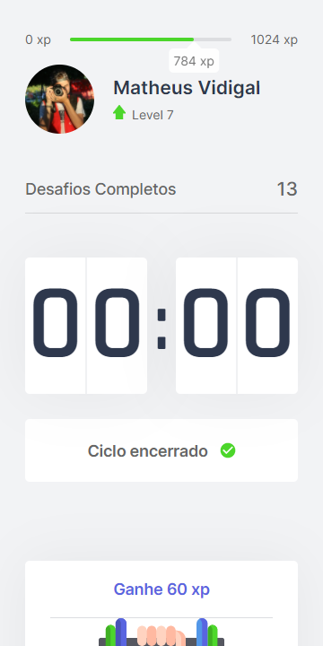
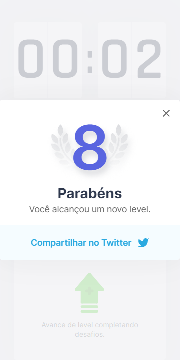

<h1 align="center">
  <br>
    
</h1>
<h4 align="center">
    Trilha ReactJS 
</h4>
<!-- <h4 align="center">Projeto web construído durante o Next Level Week #04-Discovery com a Rocketseat/DiegoFernandes.</h4> -->
<p align="center">
  
  <a aria-label="Completado" href="https://nextlevelweek.com/episodios/omnistack/edicao/4">
    </img>
  </a>
  
  <a href="https://github.com/NyctibiusVII/NLW-4-Discovery/blob/master/LICENSE">
    
  </a>
  <a href="https://picpay.me/Matheus_nyctibius_vii">
  
  </a>
</p>
<p align="center">
  <a href="#moveit-">Projeto</a>&nbsp;&nbsp;&nbsp;|&nbsp;&nbsp;&nbsp;
  <a href="#tecnologias-">Tecnologias</a>&nbsp;&nbsp;&nbsp;|&nbsp;&nbsp;&nbsp;
  <a href="#layout-">Layout</a>&nbsp;&nbsp;&nbsp;|&nbsp;&nbsp;&nbsp;
  <a href="#licença-%EF%B8%8F">Licença</a>
</p>
<!--
<p align="center">
    <a href="README.md">Inglês</a>
    ·
    <a href="README-pt.md">Português</a>
</p>
-->

# MoveIt 
Projeto desenvolvido para gerenciar melhor o seu tempo, saúde mental e física usando a técnica de pomodoro. Projeto realizado na Next Level Week #4 @Rocketseat.

<br>

<details>
    <summary>Como é a técnica Pomodoro</summary>

```
Pomodoro significa tomate em italiano. A fruta faz alusão ao tempo durante o qual você pode fazer determinada tarefa.
Cada pomodoro é dividido em quatro pomodoris, e cada um destes equivale a 30 minutos.

O método Pomodoro é simples e dura (n) horas. Primeiro, você realiza uma atividade durante 25 minutos.
Quando acabar o tempo, descansa 5 minutos. Assim sucessivamente até que complete as (n) horas.

O conceito do Pomodoro é que a pessoa que vai estudar ou executar uma tarefa demore, exatamente, 25 minutos.
Concluindo-a ou não, ele deve parar e descansar 5 minutos.
```
</details>

<details>
    <summary>Vantagens de usar a técnica Pomodoro</summary>

```
- Alivia a ansiedade;
- Aumenta o foco e a concentração por meio da redução das interrupções.
- Aumenta a conscientização das decisões.
- Aumenta a motivação e mantém-na constante.
- Reforça a determinação para atingir os objetivos.
- Melhora o processo de trabalho ou estudo.
- Reforça sua determinação de continuar a aplicar-se em face de complexas situações.
```
</details>

###### Por Silvia Tancredi - Jornalista

<br>

#### Funcionalidades
* Gerenciar seu tempo.
* Níveis de xp aumentados conforme sua evolução na técnica pomodoro.
* Compartilhamento de seu progresso (Twitter).
* Notificação auditiva e visual.
* Site responsivo.

## Tecnologias 🚀
Esse projeto foi desenvolvido com as seguintes tecnologias:
- [Html | 5](https://pt.wikipedia.org/wiki/HTML)
- [Css | 3](https://pt.wikipedia.org/wiki/Cascading_Style_Sheets)
- [Typescript | ^4.1.5](https://www.typescriptlang.org/)
- [ReactJS | ^17.0.1](https://pt-br.reactjs.org/)
- [NextJS | ^10.0.7](https://nextjs.org/)
- [NodeJS | ^15.9.0](https://nodejs.org/en/)

## Layout 🚧
#### Desktop Screenshot
<div style="display: flex; flex-direction: 'column'; align-items: 'center';">
<!-- Responsive, 1440 x 900, 50% (Laptop L - 1440px)--><!--
    -->
    
    
    
    
</div>

#### Mobile Screenshot
<div style="display: flex; flex-direction: 'row';">
<!-- Responsive, 425 x 900, 60% (Mobile L - 425px)--><!--
    -->
    
    <!--
    
    -->
</div>

## Rodando o projeto 🚴🏻‍♂️
#### "Só vou dar uma olhadinha...":
  <a href="https://moveit-nyctibiusvii.vercel.app/">⏰ Site hospedado na Vercel 🏆</a>

#### Na sua maquina:
<details>
    <summary>Dependências</summary>

```json
  "dependencies": {
    "js-cookie": "^2.2.1",
    "next": "10.0.7",
    "react": "17.0.1",
    "react-confetti": "^6.0.1",
    "react-dom": "17.0.1"
  },
  "devDependencies": {
    "@types/js-cookie": "^2.2.6",
    "@types/node": "^14.14.31",
    "@types/react": "^17.0.2",
    "@types/react-dom": "^17.0.1",
    "typescript": "^4.1.5"
  }
    //Ex: $ npm install @types/_____ -D
```
</details>

```bash
# Clone o repositório
$ git clone https://github.com/NyctibiusVII/NLW-4-Discovery.git

# Acesse a pasta do projeto no prompt de comando
$ cd moveit

# Instale as dependências
$ npm install

# Execute o script "dev"
$ npm run dev

# O projeto inciará na porta: 3000 - acesse http://localhost:3000
```

## Contribuição 💭
Para construir essa aplicação tive a ajuda do professor **Diego Fernandes** da Rocketseat que disponibilizou video aulas do projeto **NLW#4-Discovery** e tive uma ajuda desta grande comunidade que a Rocketseat construiu no *Discord*.
Feito com ♥ by Rocketseat :wave: [Participe da nossa comunidade!](https://discord.gg/YxU7fJT)

### Hashtags \#
| Dias  | Hashtags            |
|-------|---------------------|
| Dia 1 | #RumoAoProxímoNivel |
| Dia 2 | #JornadaInfinita    |
| Dia 3 | #FocoPraticaGrupo   |
| Dia 4 | #NeverStopLearning  |
| Dia 5 | #MissionComplete    |

## Licença ⚖️
Este projeto está sob a licença do MIT. Veja o arquivo [LICENSE](https://github.com/NyctibiusVII/NLW-4-Discovery/blob/master/LICENSE) para mais detalhes.

## Contato ✉️
| <br><sub><a href="https://www.instagram.com/nyctibius_vii/?hl=pt-br">@MatheusVidigal🦊</a></sub> |
| :---: |

<p align="left">
    <a href="https://www.linkedin.com/in/matheus-vidigal-nyctibiusvii/">
        
    </a>
    <a href="https://mail.google.com/mail/u/1/#inbox?compose=GTvVlcSGLCKpKJfwPsKKqzXBplKkGtCLvCQcFWdWxCxQFfkHzzjVkgzrMFPBgKBmWFHvrjrCsMqSH">
        
    </a>
</p>