<h1 align="center">
    <br>
    
</h1>
<h4 align="center">
    Trilha ReactJS 
</h4>
<!-- <h4 align="center">Projeto web construído durante o Next Level Week #04-Discovery com a Rocketseat/DiegoFernandes.</h4> -->
<p align="center">
    
    <a aria-label="Completado" href="https://nextlevelweek.com/episodios/omnistack/edicao/4">
        </img>
    </a>
    
    <a href="https://github.com/NyctibiusVII/MoveIt/blob/master/LICENSE">
        
    </a>
    <a href="https://picpay.me/Matheus_nyctibius_vii">
        
    </a>
</p>
<p align="center">
    <a href="#moveit-">Projeto</a>&nbsp;&nbsp;&nbsp;|&nbsp;&nbsp;&nbsp;
    <a href="#tecnologias-">Tecnologias</a>&nbsp;&nbsp;&nbsp;|&nbsp;&nbsp;&nbsp;
    <a href="#layout-">Layout</a>&nbsp;&nbsp;&nbsp;|&nbsp;&nbsp;&nbsp;
    <a href="#licença-%EF%B8%8F">Licença</a>
</p>
<!--
<p align="center">
    <a href="README.md">Inglês</a>
    ·
    <a href="README-pt.md">Português</a>
</p>
-->

# MoveIt 
Projeto desenvolvido para gerenciar melhor o seu tempo, saúde mental e física usando a técnica de pomodoro. Projeto realizado na Next Level Week #4 @Rocketseat.

<br>

<details>
    <summary>Como é a técnica Pomodoro</summary>

```
Pomodoro significa tomate em italiano. A fruta faz alusão ao tempo durante o qual você pode fazer determinada tarefa.
Cada pomodoro é dividido em quatro pomodoris, e cada um destes equivale a 30 minutos.

O método Pomodoro é simples e dura (n) horas. Primeiro, você realiza uma atividade durante 25 minutos.
Quando acabar o tempo, descansa 5 minutos. Assim sucessivamente até que complete as (n) horas.

O conceito do Pomodoro é que a pessoa que vai estudar ou executar uma tarefa demore, exatamente, 25 minutos.
Concluindo-a ou não, ele deve parar e descansar 5 minutos.
```
</details>

<details>
    <summary>Vantagens de usar a técnica Pomodoro</summary>

```
- Alivia a ansiedade;
- Aumenta o foco e a concentração por meio da redução das interrupções.
- Aumenta a conscientização das decisões.
- Aumenta a motivação e mantém-na constante.
- Reforça a determinação para atingir os objetivos.
- Melhora o processo de trabalho ou estudo.
- Reforça sua determinação de continuar a aplicar-se em face de complexas situações.
```
</details>

###### Por Silvia Tancredi - Jornalista

<br>

#### Funcionalidades
* Gerenciar seu tempo.
* Níveis de xp aumentados conforme sua evolução na técnica pomodoro.
* Compartilhamento de seu progresso (Twitter) com imagem dinâmica via URL de (1200 x 630).
* Notificação auditiva e visual.
* Modal Cookies consent
* MongoDB
* Site responsivo.

<details>
    <summary>Desafios</summary>

```
✔ - Documentar bem o projeto
✔ - Melhorar o estilo: Responsividade e Design
✔ - Confetes atras do modal quando passar de level
✔ - Barra de progresso (tempo restante) em baixo do botão (Abandonar ciclo e Ciclo encerrado)
✔ - Bloquear funcionalidades se não estiver logado
✔ - Banco de dados
✔ - API-REST
✖ - Next PWA

Funcionalidades:
    - Mensagem de aviso ao sair da pagina ("O timer esta ativo!")
    ✔ - Trocar o tema da aplicação: Light e Dark
    ✔ - Consumo de api-rest
    ✔ - Banco de dados externo (MongoDB)
    ✔ - oAuth github (Pagina de login)
    ✔ - COOKIES:
        ✔ - Cookies consent
        ✔ - Guardar dados
        ✔ - Alterar dados
        ✔ - Deletar dados
    ✔ - MongoDB:
        ✔ - Guardar dados
        ✔ - Alterar dados
        ✔ - Deletar dados
    ✔ - Sidebar lateral #Desktop:
        ✔ - Logo (img)
        ✔ - Home
        ✔ - Leaderbord
        ✔ - Settings
    ✔ - Float action button #Mobile:
        ✔ - Home
        ✔ - Leaderbord
        ✔ - Settings
    ✔ - Toast:
        ✔ - Cor dinâmica
        ✔ - Icon dinâmico
        ✔ - Texto dinâmico
        ✔ - ToastBar countdown
        ✔ - Animação de entrada e saida
    - Telas:
        ✔ - Home
        ✔ - Leaderbord
        - Settings
        ✔ - Login
        ✔ - 404
    ✔ - Compartilhar com o Twitter:
        ✔ - Botão em baixo do modal (Compartilhar no Twitter (img))
            ✔ - Texto com:
                ✔ - qts Desafios
                ✔ - qts xp
                ✔ - qts Level
            ✔ - Link para a img dinâmica
            ✔ - Hashtags
            ✔ - Autor
        ✔ - Criar img dinâmica para compartilhar:
            ✔ - (API) image-generator:
                ✔ - qts Desafios
                ✔ - qts xp
                ✔ - qts Level
```
</details>

## Tecnologias 🚀
Esse projeto foi desenvolvido com as seguintes tecnologias:
- [Html | 5](https://pt.wikipedia.org/wiki/HTML)
- [Css | 3](https://pt.wikipedia.org/wiki/Cascading_Style_Sheets)
- [Typescript | ^4.1.5](https://www.typescriptlang.org/)
- [ReactJS | ^17.0.1](https://pt-br.reactjs.org/)
- [NextJS | ^10.0.7](https://nextjs.org/)
- [NodeJS | ^15.9.0](https://nodejs.org/en/)

## Layout 🚧
## Desktop Screenshot
<div style="display: flex; flex-direction: 'column'; align-items: 'center';">
<!-- Responsive, 1440 x 900, 50% (Laptop L - 1440px)-->
    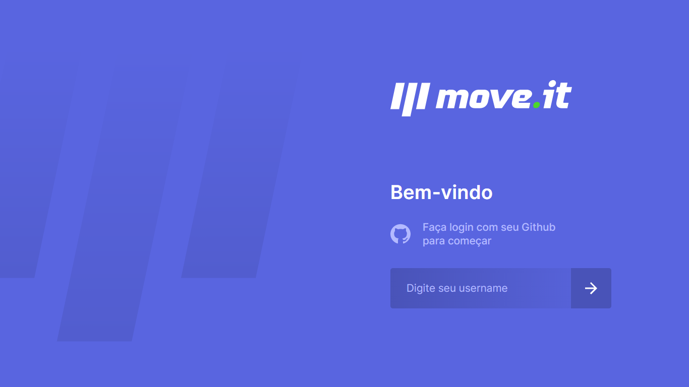
    <!--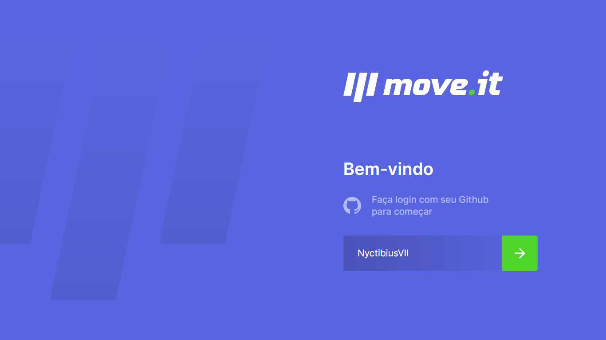-->
    <!--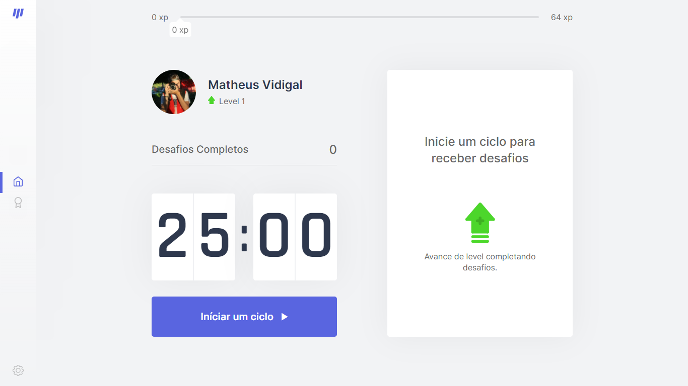-->
    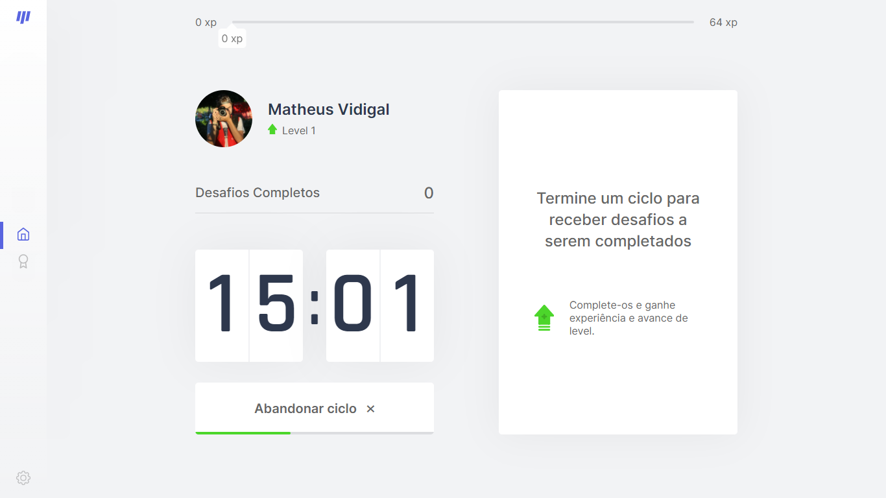
    <!--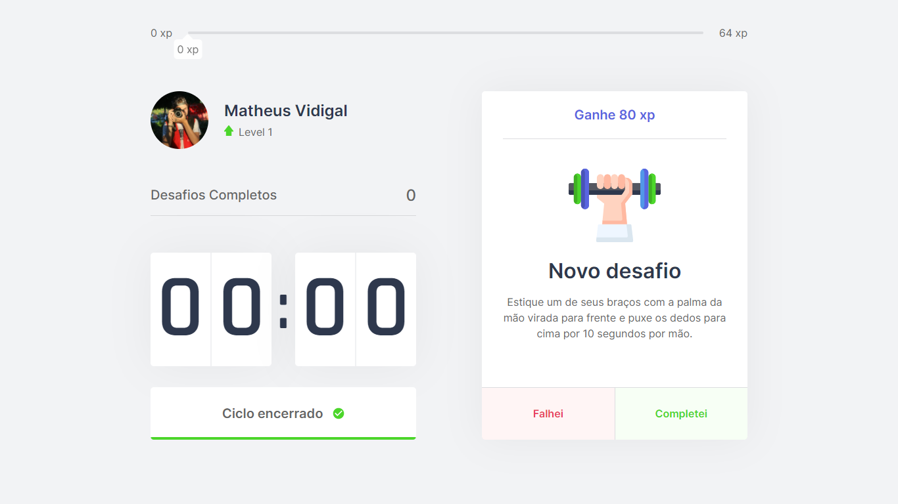-->
    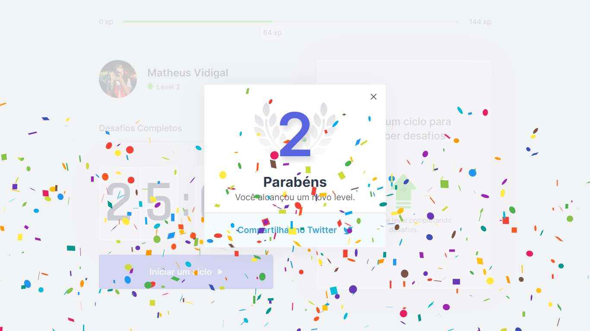
    <!--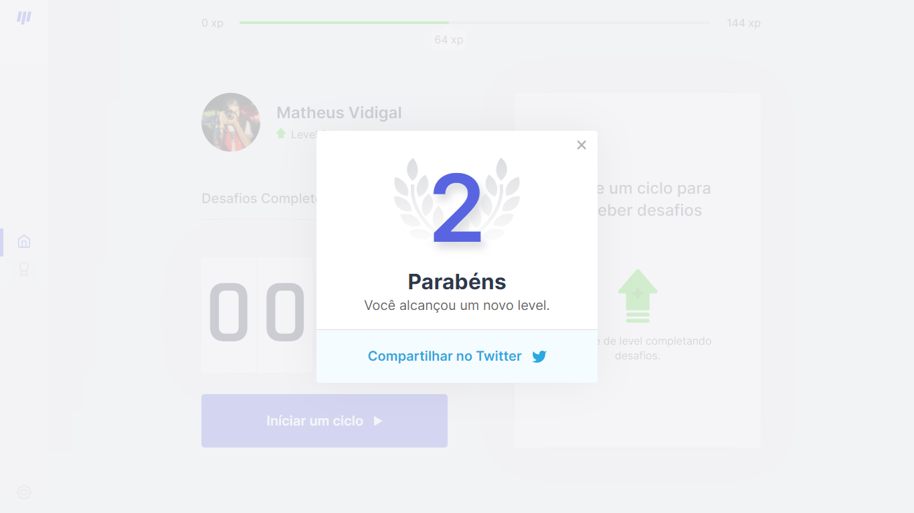-->
    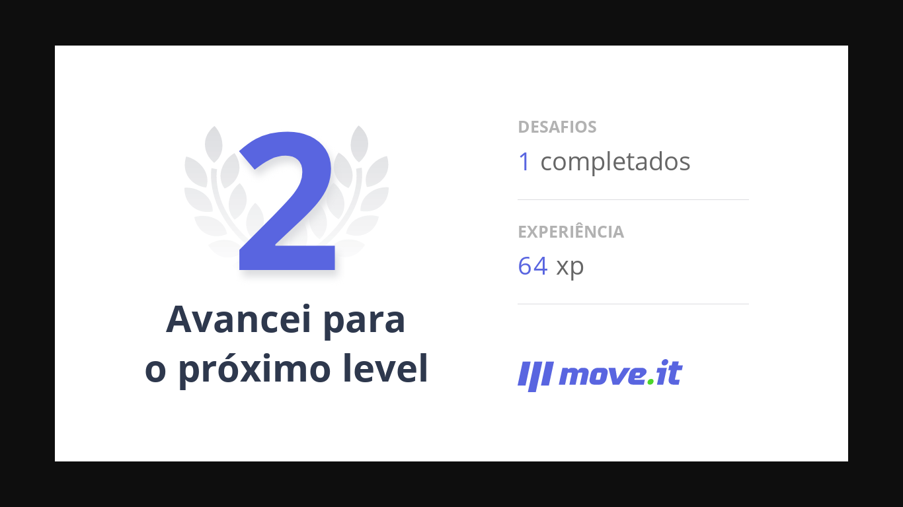
    <!--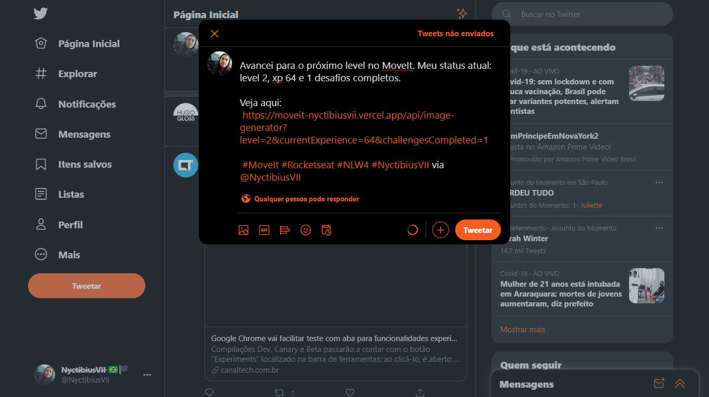-->
    <!---->
    <!--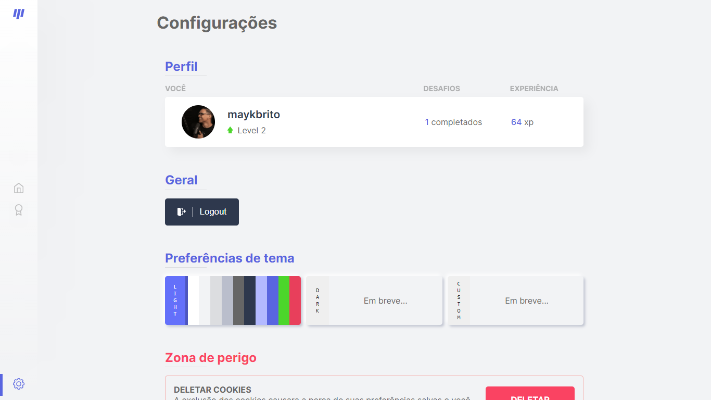-->
    <!--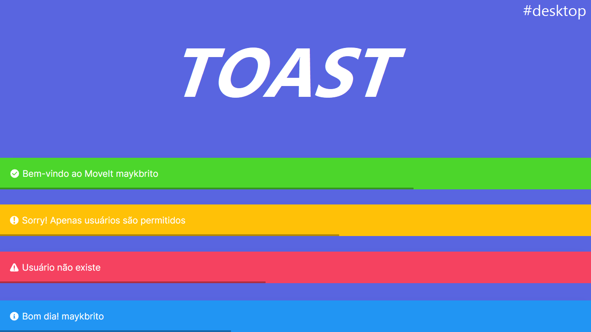-->
</div>
<a href="./.github/README-IMGS.md">Ver mais</a>

## Mobile Screenshot
<div style="display: flex; flex-direction: 'row';">
<!-- Responsive, 425 x 900, 60% (Mobile L - 425px)-->
    <!--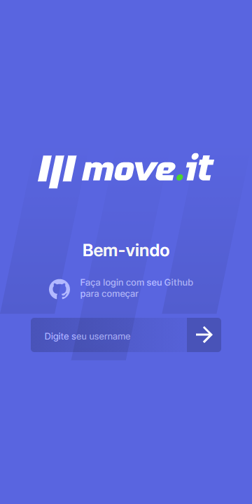-->
    <!--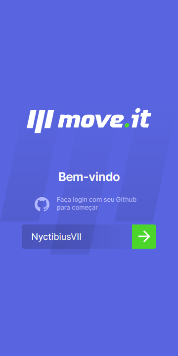-->
    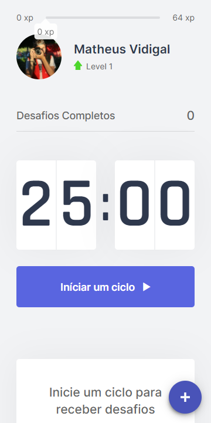
    <!--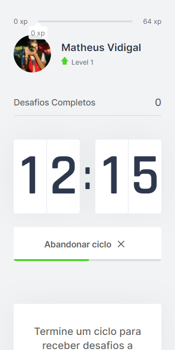-->
    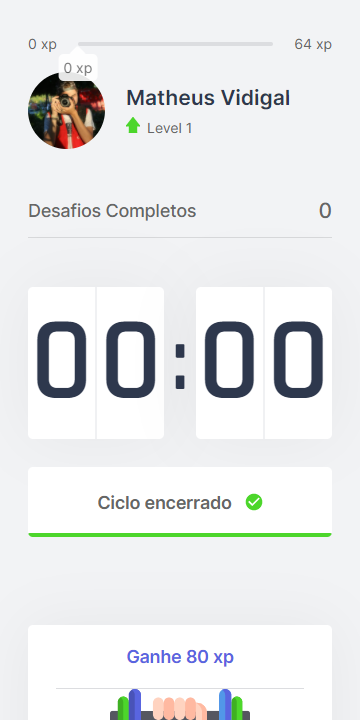
    <!--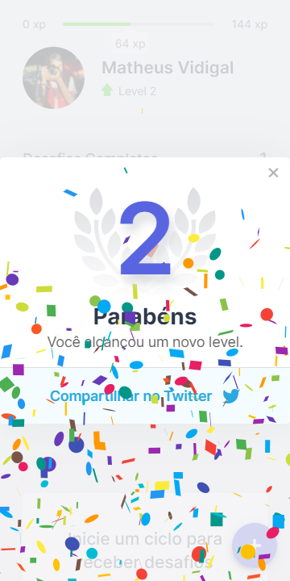-->
    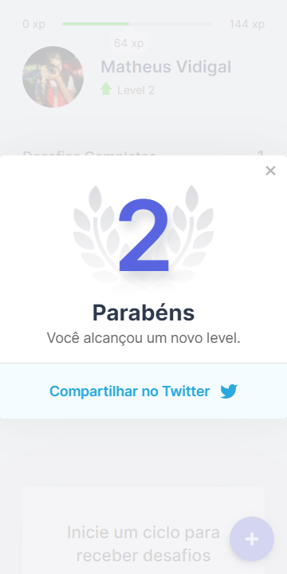
    <!---->
    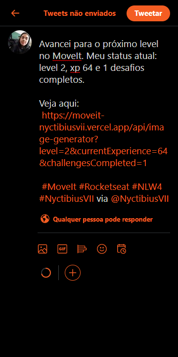
    <!---->
    <!--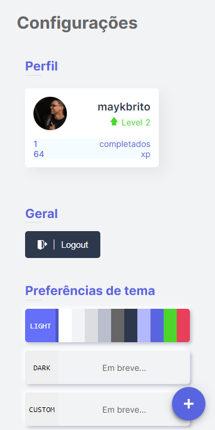-->
    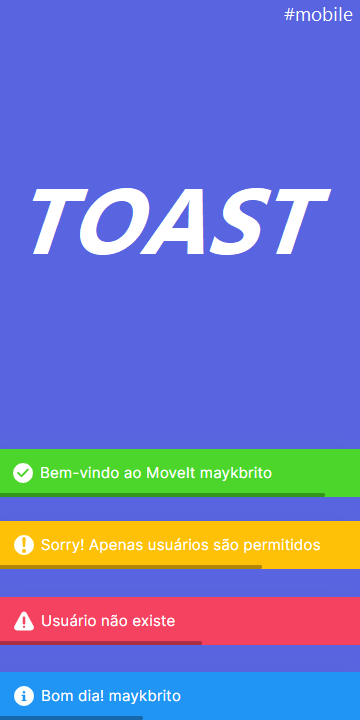
    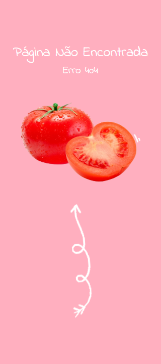
</div>
<a href="./.github/README-IMGS.md">Ver mais</a>
    <!-- IMGS
      ------------------------------
      login-blank
      login-filled
      ------------------------------
      initial-countdown
      half-countdown
      final-countdown
      ------------------------------
      modal-with-confetti
      modal-without-confetti
      ------------------------------
      image-next-level
      twitter-next-level
      ------------------------------
      leaderbord
      configs
      404
      ------------------------------
    -->

## Rodando o projeto 🚴🏻‍♂️
#### "Só vou dar uma olhadinha...":
  <a href="https://moveit-nyctibiusvii.vercel.app/">⏰ Site hospedado na Vercel 🏆</a>

#### Na sua maquina:
<details>
    <summary>Dependências</summary>

```json
  "dependencies": {
    "axios": "^0.21.1",
    "chrome-aws-lambda": "^10.1.0",
    "js-cookie": "^3.0.0",
    "next": "^11.1.2",
    "puppeteer-core": "^10.2.0",
    "react": "^17.0.2",
    "react-confetti": "^6.0.1",
    "react-copy-to-clipboard": "^5.0.4",
    "react-dom": "^17.0.2"
  },
  "devDependencies": {
    "@types/js-cookie": "^2.2.7",
    "@types/node": "^16.7.10",
    "@types/react": "^17.0.19",
    "@types/react-copy-to-clipboard": "^5.0.1",
    "@types/react-dom": "^17.0.9",
    "eslint": "^7.32.0",
    "eslint-config-next": "^11.1.2",
    "typescript": "^4.4.2"
  }
```
> Ex: `$ npm install _____` para instalar as dependências

> Utilize a tag `-D` para instalar as dependências de desenvolvimento.
> Utilize a tag `@types` para instalar o suporte a Typescript.
> Utilize a tag `@latest` para instalar a versão mais recente.
</details>

```bash
# Clone o repositório
$ git clone https://github.com/NyctibiusVII/MoveIt.git

# Acesse a pasta do projeto no prompt de comando
$ cd moveit

# Instale as dependências
$ npm install

# Execute o script "dev"
$ npm run dev

# O projeto inciará na porta: 3000 - acesse http://localhost:3000
```

## Contribuição 💭
Para construir essa aplicação tive a ajuda do professor **Diego Fernandes** da Rocketseat que disponibilizou video aulas do projeto **MoveIt** e tive uma ajuda desta grande comunidade que a Rocketseat construiu no *Discord*.
Feito com ♥ by Rocketseat :wave: [Participe da nossa comunidade!](https://discord.gg/YxU7fJT)

### Hashtags \#
| Dias  | Hashtags            |
|-------|---------------------|
| Dia 1 | #RumoAoProxímoNivel |
| Dia 2 | #JornadaInfinita    |
| Dia 3 | #FocoPraticaGrupo   |
| Dia 4 | #NeverStopLearning  |
| Dia 5 | #MissionComplete    |

## Licença ⚖️
Este projeto está sob a licença do MIT. Veja o arquivo [LICENSE](https://github.com/NyctibiusVII/MoveIt/blob/master/LICENSE) para mais detalhes.

## Contato ✉️
| <br><sub><a href="https://www.instagram.com/nyctibius_vii/?hl=pt-br">@MatheusVidigal🦊</a></sub> |
| :---: |

<p align="left">
    <a href="https://www.linkedin.com/in/matheus-vidigal-nyctibiusvii/">
        
    </a>
    <a href="https://mail.google.com/mail/u/1/#inbox?compose=GTvVlcSGLCKpKJfwPsKKqzXBplKkGtCLvCQcFWdWxCxQFfkHzzjVkgzrMFPBgKBmWFHvrjrCsMqSH">
        
    </a>
</p>